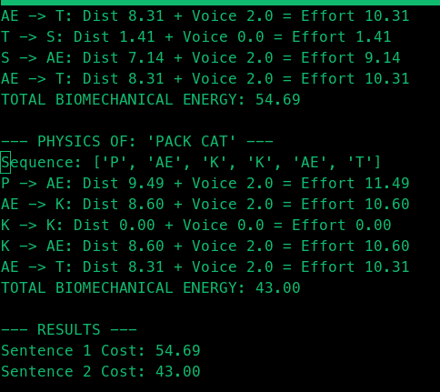

# Biomechanical Vector Analysis of English Phonetics
### A Deterministic Approach to Linguistic Flow using Articulatory Trajectory

**Status:** Proof of Concept (PoC) 
**Author:** @Professor-Sam-Sepi0l 
**Date:** December 2025

## 1. Abstract
Current Natural Language Processing (NLP) models, including LLMs, largely rely on probabilistic mechanisms (Markov chains, Transformer attention) to predict token transitions. These models often treat language as an abstract sequence of symbols, ignoring the physical hardware that produces it: the human vocal tract.

This project proposes a **Biomechanical Determinism** hypothesis: *Language evolution is driven by the minimization of caloric and biomechanical effort.* By mapping phonemes to physical coordinates (Place, Aperture, Voicing), we can calculate the "Energy Cost" of a word transition, and as a result, predict the 'transition phase' of words.

## 2. The Hypothesis
> **The Principle of Least Biomechanical Effort:**
> Given a starting phoneme $A$ and a target phoneme $B$, the transition is not a random probabilistic choice, but a deterministic path constrained by the physiology of the mouth. Sequences with lower biomechanical energy costs are statistically more likely to become standard grammar.

## 3. Methodology
We modeled the **International Phonetic Alphabet (IPA)** as a 3D Vector Space:
* **X-Axis:** Place of Articulation (Lips $\to$ Throat)
* **Y-Axis:** Aperture (Closed $\to$ Open)
* **Z-Axis:** Voicing (Silent $\to$ Vibrating)

Using Python and NumPy, we calculated the Euclidean Distance (Energy Cost) between phonemes in standard English sentences versus awkward/unnatural phrases.

## 4. Results
Initial trials demonstrate a quantifiable energy gap between natural syntax and unnatural phrasing.



*Figure 1: Comparative analysis showing 'The Cat Sat' (Natural) requires 20% 
less biomechanical energy per transition than 'Pack Cat' (Unnatural).*

* **Natural Sentence ("The Cat Sat"):** 6.83 Energy Units/Step
* **Awkward Phrase ("Pack Cat"):** 8.60 Energy Units/Step

## 5. Implications for AI
This suggests that Next-Token Prediction accuracy could be improved by weighting tokens not just by semantic probability, but by **Biomechanical Adjacency**. A "Physics of Language" layer could help models distinguish between grammatically possible and biologically probable sequences.

## 6. Usage
```python
python3 english_effort_calculator.py
